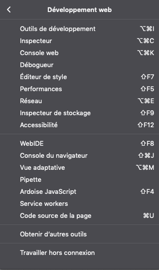
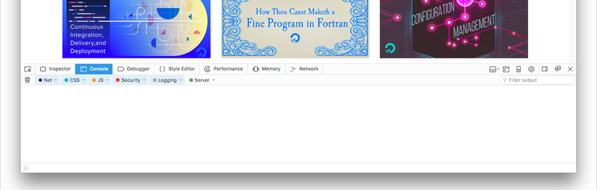
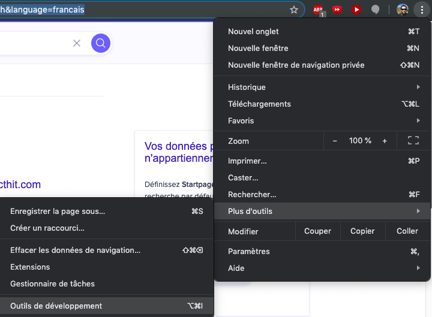
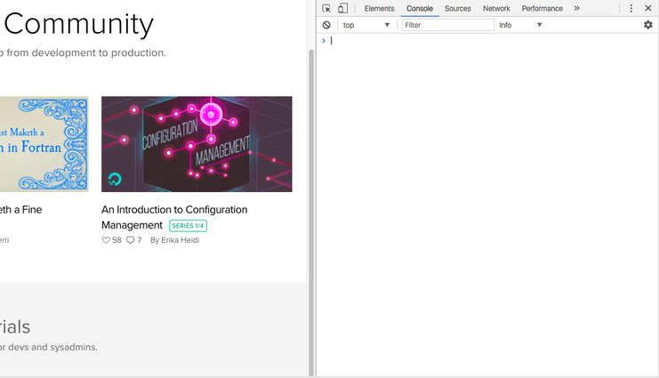
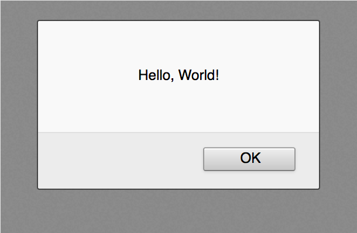
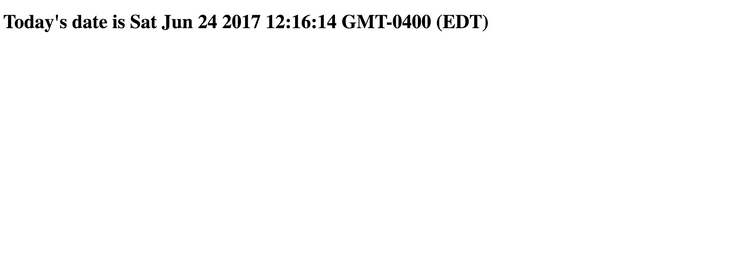
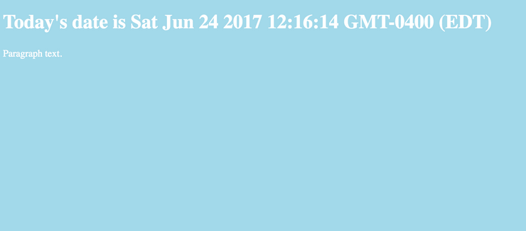
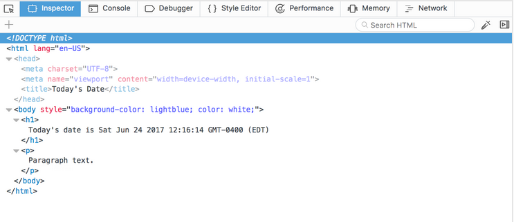
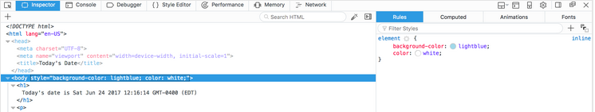

# Sommaire

1.  [Introduction](#orgcf96066)
2.  [Travailler avec la console dans un navigateur](#orgdadec0b)
3.  [Travailler avec la console](#orgfd2eb35)
4.  [Travailler avec un fichier HTML](#orgfe7d650)
5.  [Comprendre d'autres outils de développement](#orga8865a6)
6.  [Conclusion](#org1913c61)
7.  [Note du traducteur](#org84e52e8)

# Introduction

Les navigateurs modernes ont des outils de développement intégrés
avec JavaScript et d'autres technologies. Ces outils incluent la
Console qui est similaire à une interface shell, parmi les outils
pour inspecter le DOM, déboguer, et analyser l'activité du réseau. 

La console peut être utilisée pour enregistrer des informations
dans le cadre du processus de développement JavaScript, ainsi que
pour vous permettre d'interagir avec une page Web en exécutant des
expressions JavaScript dans le contexte de la page. Pour
l'essentiel, la console vous permet d'écrire, de gérer et de
surveiller JavaScript à la demande. 

Ce didacticiel explique comment utiliser la console en JavaScript
dans le contexte d'un navigateur et donne un aperçu des autres
outils de développement intégrés que vous pouvez utiliser dans le
cadre de votre processus de développement Web.

# Travailler avec la console dans un navigateur

La plupart des navigateurs Web modernes prenant en charge les
langages HTML et XHTML standard vous donnent accès à une console de
développement sur laquelle vous pouvez utiliser JavaScript dans une
interface similaire à un terminal. Nous verrons comment accéder à la
console dans Firefox et Chrome. 

## Firefox

Pour ouvrir la [console web](https://developer.mozilla.org/en-US/docs/Tools/Web_Console) dans Firefox, vous pouvez naviguer dans
le menu ☰ dans le coin supérieur droit après la barre d'adresse.

De là, cliquez sur le bouton Développement web, ce qui ouvrira le
menu Développement Web. Cela étant ouvert, cliquez sur l'élément de
menu de la Console web (ou Outils de développement).

Une fois que vous le ferez, un plateau s'ouvrira au bas de la
fenêtre de votre navigateur :

Vous pouvez également accéder à la Console web à l'aide du
raccourci clavier `CTRL + SHIFT + K` sur Linux et Windows ou
`COMMAND + OPTION + K` sur macOS.

Maintenant que nous avons accédé à la console, nous pouvons
commencer à y travailler en JavaScript.

## Chrome

Pour ouvrir la [console JavaScript](https://developers.google.com/web/tools/chrome-devtools/console/) dans Chrome, vous pouvez naviguer
dans le menu supérieur droit de la fenêtre de votre navigateur,
indiqué par trois points verticaux à la suite. À partir de là, vous
pouvez sélectionner Plus d'outils, puis Outils de développement.

Cela ouvrira un panneau où vous pourrez cliquer sur **Console** dans
la barre de menus supérieure pour afficher la console JavaScript si
elle n'est pas déjà mise en surbrillance : 

Vous pouvez également accéder à la console JavaScript à l'aide du
raccourci clavier `CTRL + SHIFT + J` sur Linux ou Windowd, ou
`COMMAND + OPTION + J` sur macOS, ce qui mettra immédiatement
l'accent sur la console.

Maintenant que nous avons accédé à la console, nous pouvons
commencer à y travailler en JavaScript.

# Travailler avec la console

Dans la console, vous pouvez saisir du code JavaScript.

Commençons par une alerte qui affiche la chaîne (de caractères)
`Hello, World!`:

    >> alert("Hello, World!");

Notez que la console affichera également le résultat de l'évaluation
d'une expression, qui sera considérée comme `undefined` lorsque
l'expression ne renvoie pas explicitement quelque chose.

Plutôt que d'avoir des alertes contextuelles sur lesquelles nous
devons continuer à cliquer, nous pouvons utiliser JavaScript en le
connectant à la console à l'aide de `console.log`.

Pour afficher la chaîne `Hello, World!`, nous pouvons taper la
commande suivante dans la console : 

    >> console.log("Hello, World!");

Dans la console, vous recevrez la sortie suivante : 

    Output
    Hello, World!

Nous pouvons aussi utiliser JavaScript pour réaliser des calculs
dans la console :

    >> console.log(2 + 6);

    Output
    8

Vous pouvez aussi essayer des calculs plus compliqués :

    >> console.log(34348.2342343403285953845 * 4310.23409128534);

    Output
    148048930.17230788

De plus, nous pouvons travailler sur plusieurs lignes avec des
variables :

    >> let d = new Date();
    >> console.log("Today's date is " + d);

    Output
    Today's date is Wed Jun 21 2017 15:49:47 GMT-0400 (EDT)

Si vous devez modifier une commande que vous avez passée via la
console, vous pouvez taper la touche flèche vers le haut ↑ de votre clavier
pour récupérer la commande précédente. Cela vous permettra d'éditer
la commande et de l'envoyer à nouveau.

La console JavaScript vous fournit un espace pour tester le code
JavaScript en temps réel en vous permettant d'utiliser un
environnement similaire à une interface terminal Shell.

# Travailler avec un fichier HTML

Vous pouvez également travailler dans le contexte d'un fichier HTML
ou d'une page à rendu dynamique dans la console. Cela vous permet
d'expérimenter du code JavaScript dans le contexte de HTML, CSS et
JavaScript existants. 

N'oubliez pas que dès que vous rechargez une page après l'avoir
modifiée avec la console, elle reviendra à son état antérieur à la
modification du document. Veillez donc à enregistrer toutes les
modifications que vous souhaitez conserver ailleurs. 

Prenons un document HTML vierge, tel que le fichier `index.html`
suivant, pour comprendre comment utiliser la console pour le
modifier :

    <!DOCTYPE html>
    <html lang="fr">
    
      <head>
        <meta charset="UTF-8">
        <meta name="viewport" content="width=device-width,
    				   initial-scale=1">
        <title>Date du jour</title>
      </head>
    
      <body>
    
      </body>
    
    </html>

Si vous enregistrez le fichier HTML ci-dessus et le chargez dans le
navigateur de votre choix, vous devriez voir une page vierge avec le
titre de la page comme suit : `Date du jour`.

Vous pouvez ensuite ouvrir la console et commencer à utiliser
JavaScript pour modifier la page. Nous allons commencer par utiliser
JavaScript pour insérer un en-tête dans le code HTML. 

    >> let d = new Date();
    >> document.body.innerHTML = "<h1>La du jour est " + d + "</h1>"

Vous recevrez la sortie suivante dans la console : 

    Output
    "<h1>La date du jour est Sat Jun 24 2017 12:16:14 GMT-0400 (EDT)</h1>"

À ce moment, votre page devrait ressembler à ça :

Nous pouvons aussi modifier le style de la page, tel que la couleur
de fond :

    >> document.body.style.backgroundColor = "lightblue";

    Output
    "lightblue"

Tout autant que la couleur du texte sur la page : 

    >> document.body.style.color = "white";

    Output
    "white"

Maintenant votre page ressemblera à quelque chose comme ça :

D'ici, vous pouvez créer un élément de paragraphe `
` :

    >> let p = document.createElement("P");

Avec cet élément créé, vous pouvez ensuite créer un noeud de texte
que nous pourrons ensuite ajouter au paragraphe : 

    >> let t = document.createTextNode("Paragraph text.");

Nous ajouterons le noeud de texte en l'ajoutant à la variable `p` : 

    >> p.appendChild(t);

Et finalement ajouter `p` avec son paragraphe élément `
` et le
noeud de texte ajouté au document : 

    >> document.body.appendChild(p);

Une fois ces étapes terminées, votre page HTML `index.html`
ressemblera à ceci :

La console vous offre un espace pour expérimenter la modification de
pages HTML, mais il est important de garder à l'esprit que vous ne
modifiez pas le document HTML lorsque vous effectuez des opérations
dans la console. Dans ce cas, une fois la page rechargée, un
document vierge apparaîtra.

# Comprendre d'autres outils de développement

En fonction des outils de développement du navigateur que vous
utilisez, vous pourrez utiliser d'autres outils pour vous aider dans
votre processus de développement web. Examinons quelques-uns de ces
outils.

## DOM &#x2013; Document Object Model

Chaque fois qu'une page web est chargée, le navigateur dans lequel
elle se trouve crée un modèle de document, ou DOM, de la page. 

Le DOM est une arborescence d'objets et affiche les éléments HTML
dans une vue hiérarchique. L'aborescence DOM peut être visualisée
dans le panneau [Inspecteur](https://developer.mozilla.org/en-US/docs/Tools/Page_Inspector) de Firefox ou le panneau [Eléments](https://developers.google.com/web/tools/chrome-devtools/inspect-styles/) de
Chrome.

Ces outils vous permettent d'inspecter et d'éditer des éléments
DOM, mais également d'identifier le code HTML associé à un aspect
d'une page donnée. Le DOM peut vous indiquer si un extrait de texte
ou une image possède un attribut ID et peut vous permettre de
déterminer la valeur de cet attribut.

La page que nous avons modifiée ci-dessus aurait une vue DOM
similaire à celle-ci avant de recharger la page :

De plus, vous verrez les styles CSS dans un panneau latéral ou sous
le panneau DOM, ce qui vous permet de voir quels styles sont
utilisés dans le document HTML ou via une feuille de style
CSS. Voici à quoi ressemble notre exemple de style de corps
ci-dessus dans l'inspecteur de Firefox.

Pour éditer en direct un noeud DOM, double-cliquez sur un élément
sélectionné et apportez les modifications. Pour commencer, par
exemple, vous pouvez modifier une balise `<h1>` et en faire une
balise `<h2>`.

Comme avec la console, si vous rechargez la page, vous revenez à
l'état enregistré du document HTML.

## Network (réseau)

L'onglet **Réseau** des outils de développement intégrés à votre
navigateur permet de surveiller et d'enregistrer les requêtes
réseau. Cet onglet vous indique les requêtes réseau du navigateur,
notamment lors du chargement d'une page, la durée de chaque requête
et fournit les détails de chacune de ces requêtes. Cela peut être
utilisé pour optimiser les performances de chargement de page et
les problèmes de demande de débogage. 

Vous pouvez utiliser l'onglet Réseau à côté de la Console JavaScript. En
d'autres termes, vous pouvez commencer à déboguer une page avec la
console, puis basculer sur l'onglet Réseau pour voir l'activité du
réseau sans recharger la page.

Pour en savoir plus sur l'utilisation de l'onglet Réseau, consultez
la rubrique [Utilisation de Moniteur réseau de Firefox](https://developer.mozilla.org/en-US/docs/Tools/Network_Monitor) ou
initiez-vous à l'analyse des performances du réseau avec les outils
[DevTools de Chrome](https://developers.google.com/web/tools/chrome-devtools/network/).

## Responsive Design (Conception Sensible)

Lorsque les sites web sont réactifs (*responsive*), ils sont conçus
et développés pour ressembler et fonctionner correctement sur une gamme
d'appareils différents : téléphones mobiles, tablettes, ordinateurs
de bureau et ordinateurs portables. La taille de l'écran, la
densité de pixels et le toucher tactile sont des facteurs à prendre
en compte lors du développement d'un périphérique à l'autre. En
tant que développeur web, il est important de garder à l'esprit les
principes de conception réactive (*responsive design*) afin que vos
sites web soient enitèrement disponibles pour les internautes, quel
que soit le périphérique auquel ils ont accès.

Firefox et Chrome fournissent tous deux des modes permettant de
s'assurer que les principes de conception réactive sont pris en
compte lorsque vous créez et développez des sites et des
applications pour le web. Ces modes émulent différents
périphériques que vous pouvez étudier et analyser dans le cadre de
votre processus de développement. 

Pour plus d'informations sur l'utilisation de ces outils pour un
accès plus équitable aux technologies Web, consultez l'article En
savoir plus sur [le mode de conception réactif de Firefox](https://developer.mozilla.org/en-US/docs/Tools/Responsive_Design_Mode) pour le
[mode Appareil Chrome](https://developers.google.com/web/tools/chrome-devtools/device-mode/).

# Conclusion

Ce didacticiel fournit une vue d'ensemble de l'utilisation d'une
console JavaScript dans les navigateurs Web modernes, ainsi que des
informations sur d'autres outils de développement que vous pouvez
utiliser dans votre flux de travail.

Pour en savoir plus sur JavaScript, vous pouvez en savoir plus sur
les [types de données](https://www.digitalocean.com/community/tutorials/understanding-data-types-in-javascript) ou sur les bibliothèques [jQuery](https://www.digitalocean.com/community/tutorials/an-introduction-to-jquery) ou [D3](https://www.digitalocean.com/community/tutorials/getting-started-with-data-visualization-using-javascript-and-the-d3-library).

# Note du traducteur

Ceci est une traduction de l'article [How To Use the JavaScript
Developer Console](https://www.digitalocean.com/community/tutorials/how-to-use-the-javascript-developer-console) rédigé par [Lisa Tagliaferri](https://www.digitalocean.com/community/users/ltagliaferri) pour le site DigitalOcean.

# Table des matières

1.  [Introduction](#orgcf96066)
2.  [Travailler avec la console dans un navigateur](#orgdadec0b)
    1.  [Firefox](#orgc226639)
    2.  [Chrome](#org221970b)
3.  [Travailler avec la console](#orgfd2eb35)
4.  [Travailler avec un fichier HTML](#orgfe7d650)
5.  [Comprendre d'autres outils de développement](#orga8865a6)
    1.  [DOM &#x2013; Document Object Model](#org77f5fb0)
    2.  [Network (réseau)](#org7427351)
    3.  [Responsive Design (Conception Sensible)](#orgdcc89b2)
6.  [Conclusion](#org1913c61)
7.  [Note du traducteur](#org84e52e8)
