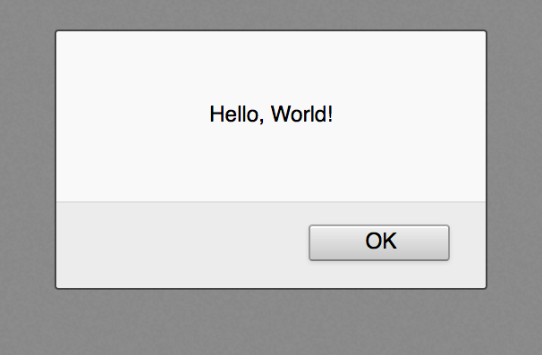
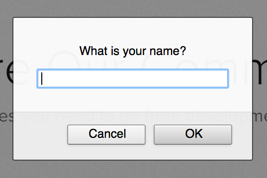
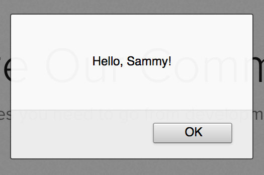

# Sommaire

1.  [Introduction](#org03bd3b2)
2.  [Pré-requis](#orgeff343f)
3.  [Création du programme "Hello, World!"](#org573ac65)
4.  [Inviter à saisir (des données)](#org600fd06)
5.  [Conclusion](#orgdeb1a0d)
6.  [Note du traducteur](#orgeaf148b)

# Introduction

Le programme "Hello, World!" est une tradition classique et
consacrée de la programmation informatique. Il s'agit d'un premier
programme court et complet pour les débutants. Il s'agit d'un bon
moyen de s'assurer que votre environnement est correctement
configuré.

Ce didacticiel vous guidera dans la création de ce programme en
JavaScript. Cependant, pour rendre le programme plus intéressant,
nous allons modifier le programme traditionnel "Hello, World!" afin
qu'il demande à l'utilisateur son nom. Nous allons ensuite utiliser
le nom dans un message d'accueil. Lorsque vous aurez terminé ce
didacticiel, vous aurez un programme interactif "Hello, World!".

# Pré-requis

Vous pouvez compléter ce didacticiel en utilisant la console de
développement JavaScript dans votre navigateur Web. Avant de
commencer ce didacticiel, vous devez vous familiariser avec
l'utilisation de cet outil. Pour en savoir plus à ce sujet vous
pouvez lire notre didacticiel "[How To Use the JavaScript Developer
Console](https://www.digitalocean.com/community/tutorials/how-to-use-the-javascript-developer-console)".

# Création du programme "Hello, World!"

Pour écrire le programme "Hello, World!", ouvrez d'abord la console
JavaScript de votre navigateur Web préféré. 

Il existe deux manières principales de créer le programme "Hello,
World!" en JavaScript, avec la méthode `alert()` et avec la méthode
`console.log()`. 

## Utiliser `alert()`

Le premier moyen d'écrire ce programme consiste à utiliser la
méthode `alert()`, qui affiche un message d'alerte sur votre
fenêtre en cours avec un message spécifié (dans ce cas, ce sera
"Hello, World!") et un bouton `OK` qui permettra à l'utilisateur de
fermer l'alerte.

Dans la méthode, nous allons lui passer le type de données chaîne
([string](https://www.digitalocean.com/community/tutorials/how-to-work-with-strings-in-javascript)) en tant que paramètre. Cette chaîne sera définie sur la
valeur `Hello, World!` afin que cette valeur soit affichée dans la
boîte d'alerte.

Pour écrire ce premier style du programme "Hello, World!", nous
encapsulons la chaîne entre parenthèses de la méthode
`alert()`. Nous terminerons notre déclaration JavaScript par un
point-virgule ([semi-colon](https://www.digitalocean.com/community/tutorials/understanding-syntax-and-code-structure-in-javascript#semicolons)). 

    alert("Hello, World!");

Une fois que vous avez appuyé sur la touche `ENTER` après votre
ligne de code JavaScript, vous devriez voir apparaître le pop-up
d'alerte suivant :

La console affichera également le résultat de l'évaluation d'une
expression, qui sera considérée comme `undefined` lorsque
l'expression ne renvoie pas explicitement quelque chose.

Il peut être fastidieux de continuer à cliquer sur les alertes
contextuelles. Voyons comment créer le même programme en le
connectant à la console à l'aide de `console.log()`.

## Utiliser `conosle.log()`

Nous pouvons imprimer la même chaîne, sauf que cette fois dans la
console JavaScript, en utilisant la méthode
`console.log()`. L'utilisation de cette option revient à travailler
avec un langage de programmation dans l'environnement terminal de
votre ordinateur.

Comme nous l'avons fait avec `alert()`, nous allons passer le
message "Hello, World!" chaîne à la méthode `console.log()`, entre
ses parenthèses. Nous terminerons notre déclaration par un
point-virgule, comme dans les conventions de la syntaxe JavaScript.

    console.log("Hello, World!");

Une fois que nous avons appuyé sur `ENTER`, le message `Hello,
   World!` sera affiché dans la Console :

Dans la section suivante, nous verrons comment rendre ce programme
plus interactif pour l'utilisateur.

# Inviter à saisir (des données)

Chaque fois que nous exécutons notre programme existant "Hello,
World!", il produit le même résultat. Invitons la personne qui
exécute notre programme à donner son nom. Nous pouvons ensuite
utiliser ce nom pour personnaliser la sortie.

Pour chacune des méthodes JavaScript que nous avons utilisées
ci-dessus, nous pouvons commencer par une ligne demandant une
saisie. Nous allons utiliser la méthode `prompt()` de JavaScript et
lui transmettre la chaîne `"What's your name?"` pour demander son
nom à l'utilisateur. L'entrée saisie par l'utilisateur sera alors
stockée dans le nom (`name`) de la [variable](https://www.digitalocean.com/community/tutorials/how-to-use-variables-in-python-3). Nous terminerons notre
expression par un point-virgule.

    let name = prompt("What is your name?");

Lorsque vous appuyez sur `ENTER` pour exécuter cette ligne de code,
vous recevez une invite contextuelle : 

La boîte de dialogue qui apparaît sur la fenêtre de votre navigateur
Web comprend un champ de texte que l'utilisateur peut saisir. Une
fois que l'utilisateur a saisi une valeur dans le champ de texte, il
doit cliquer sur `OK` pour que la valeur soit stockée. L'utilisateur
peut également empêcher l'enregistrement d'une valeur en cliqant sur
le bouton `Annuler` (*cancel*).

Il est important d'utiliser la méthode `prompt()` de JavaScript
uniquement lorsque cela a du sens dans le contexte du programme, car
son utilisation excessive peut devenir fastidieuse pour
l'utilisateur.

À ce stade, entrez le nom que vous souhaitez que le programme
salue. Pour cet exemple, nous utiliserons le nom `Sammy`.

Maintenant que nous avons collecté la valeur du nom de
l'utilisateur, nous pouvons passer à l'utilisation de cette valeur
pour saluer l'utilisateur.

## Saluer l'utilisateur avec `alert()`

Comme indiqué ci-dessus, la méthode `alert()` crée une boîte de
dialogue située au-dessus de la fenêtre du navigateur. Nous pouvons
utiliser cette méthode pour saluer l'utilisateur en utilisant le
`nom` de la variable. 

Nous utiliserons la concaténation de chaînes ([string concatenation](https://www.digitalocean.com/community/tutorials/how-to-work-with-strings-in-javascript#string-concatenation))
pour écrire un message d'accueil "Hello!" qui s'adresse directement
à l'utilisateur. Donc, concaténons la chaîne `Hello` avec la
variable nom : 

    "Hello, " + name + "!"

Nous avons combiné deux chaînes, "Hello, " et "!" avec la variable
`name` au milieu. Maintenant, nous pouvons passer cette expression
à la méthode `alert()`.

    alert("Hello, " + name + "!");

Une fois que vous avez appuyé sur `ENTER` ici, la boîte de dialogue
suivante s'affiche à l'écran : 

Dans ce cas, le nom de l'utilisateur est Sammy. La sortie a donc
salué Sammy. 

Maintenant, réécrivons cela pour que le résultat soit affiché dans
la console.

## Saluer l'utilisateur avec `console.log()`

Comme nous l'avons vu dans une section précédente, la méthode
`console.log()` affiche la sortie dans la console, tout comme la
fonction `print()` peut afficher la sortie dans le terminal en
Python.

Nous utiliserons la même chaîne concaténée que celle que nous avons
utilisée avec la méthode `alert()`, qui combine les chaînes
`"Hello" et ="!"` avec la variable `name` :

    "Hello, " + name + "!"

Toute cette expression sera placée entre les parenthèses de la
méthode `console.log()` afin que nous puissions recevoir un message
de salutation en sortie.

    console.log("Hello, " + name + "!");

Pour un utilisateur nommé Sammy, la sortie sur la console sera la
suivante : 

Vous avez maintenant un programme JavaScript qui prend les entrées
d'un utilisateur et les affiche à l'écran.

# Conclusion

Maintenant que vous savez comment écrire le programme classique
"Hello, World!", ainsi que demander à l'utilisateur d'entrer son
nom, et l'afficher en sortie, vous pouvez continuer à développer
votre programme. Par exemple, demandez la couleur préférée de
l'utilisateur et demandez au programme de dire que sa couleur
préférée est le rouge. Vous pourriez même essayer d'utiliser cette
même technique pour créer un programme Mad Lib.

# Note du traducteur

Traduction de l'article [How To Write Your First JavaScript Program](https://www.digitalocean.com/community/tutorials/how-to-write-your-first-javascript-program)
rédigé par [Lisa Tagliaferri](https://www.digitalocean.com/community/users/ltagliaferri) pour le site [Digitalocean](https://www.digitalocean.com/).

# Table des matières

1.  [Introduction](#org03bd3b2)
2.  [Pré-requis](#orgeff343f)
3.  [Création du programme "Hello, World!"](#org573ac65)
    1.  [Utiliser `alert()`](#org24ed0a8)
    2.  [Utiliser `conosle.log()`](#org887bee9)
4.  [Inviter à saisir (des données)](#org600fd06)
    1.  [Saluer l'utilisateur avec `alert()`](#org3091f07)
    2.  [Saluer l'utilisateur avec `console.log()`](#org2201c74)
5.  [Conclusion](#orgdeb1a0d)
6.  [Note du traducteur](#orgeaf148b)
