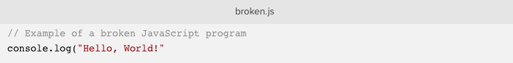
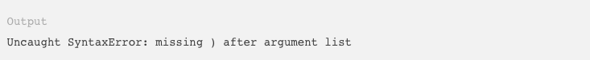
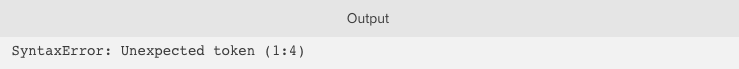

# Sommaire

1.  [Introduction](#orgbc98a27)
2.  [Fonctionnalité et lisibilité](#org7441546)
3.  [Espaces (blancs)](#org05f28d6)
    1.  [Les parenthèses](#orgf00d37c)
4.  [Points-virgules](#org1eb99e5)
5.  [Indentation](#org68448ca)
6.  [Identifiants](#orgbccb5ce)
    1.  [Sensible à la casse](#org780a5ef)
    2.  [Mots-clés réservés](#org38e5980)
7.  [Conclusion](#orgc877d12)
8.  [Note du traducteur](#org372c3cf)

# Introduction

Avant d'apprendre à écrire dans une langue parlée, vous devez
d'abord apprendre les règles de la grammaire. Voici quelques
exemples de règles que vous pourriez trouver en anglais (ou en
français) : 

-   Une phrase commence par une lettre capitale.
-   Une phrase finit par un point.
-   Un nouveau paragraphe est indenté.
-   Le langage parlé est mis entre guillemets.

De même, tous les langages de programmation doivent adhérer à des
règles spécifiques pour fonctionner. Cet ensemble de règles qui
déterminent la structure correcte des langages de programmation est
appelé **syntaxe**. De nombreux langages de programmation se composent
en grande partie de concepts similaires avec des variantes de
syntaxe.

Dans ce didacticiel, nous allons passer en revue de nombreuses
règles et conventions de la syntaxe et la stucture du code
JavScript.  

# Fonctionnalité et lisibilité

La fonctionnalité et la lisibilité sont deux raisons importantes de
privilégier la syntaxe lorsque vous commencez à utiliser JavaScript.

Certaines règles de syntaxe sont obligatoires pour la fonctionnalité
JavaScript. S'ils ne sont pas suivis, la console émettra une erreur
et le script cessera son exécution.

Considérez une erreur de syntaxe dans le programme "Hello, World!" : 

La parenthèse fermante est manquante dans cet exemple de code et
remplace l'impression attendue du message "Hello, World!" dans la
console, l'erreur suivante apparaîtra : 

La `)` manquante doit être ajoutée avant que le script ne continue à
s'exécuter. Ceci est un exemple de la façon dont une erreur de
syntaxe JavaScript peut casser le script, car une syntaxe correcte
doit être suivie pour que le code puisse s'exécuter.

Certains aspects de la syntaxe et du formatage de JavaScript sont
basés sur différentes écoles de pensée. En d'autres termes,
certaines règles ou choix stylistiques ne sont pas obligatoires et
n'entraîneront aucune erreur lors de l'exécution du code. Cependant,
il existe de nombreuses conventions communes qu'il est judicieux de
suivre, car les développeurs entre les projets et les bases de code
seront plus familiarisés avec le style. Le respect des conventions
courantes améliore la lisibilité. 

Considérez les trois exemples suivants d'affection de variable.

    const greeting="Hello";          // pas d'espace entre variable et chaîne
    const greeting =       "Hello"; // espace excessif après la déclaration
    const greeting = "Hello";      // un simple espace entre variable et chaîne

Bien que les trois exemples ci-dessus fonctionnent exactement de la
même manière dans la sortie, la troisième option, `greeting =
  "Hello";` est de loin la méthode la plus utilisée et la plus lisible
pour écrire le code, en particulier si elle est considérée dans le
contexte d'un programme plus vaste.

Il est important que le style de votre projet de codage reste
cohérent. D'une organisation à l'autre, vous rencontrerez
différentes règles à suivre. Vous devez donc également faire preuve
de souplesse. 

Nous allons passer en revue quelques exemples de code ci-dessous
afin de vous familiariser avec la syntaxe et la structure du code
JavaScript et de vous reporter à cet article en cas de doute. 

# Espaces (blancs)

Les espaces en JavaScript sont des espaces, des onglets et des
nouvelles lignes (en appuyant sur la touche `ENTER` du
clavier). Comme démontré précédemment, les espaces blancs excessifs
en dehors d'une chaîne et les espaces entre opérateurs et autres
symboles sont ignorés par JavaScript. Cela signifie que les trois
exemples suivants d'affectation de variable auront exactement la
même sortie calculée : 

    const userLocation     =     "New York City, "        +  "NY";
    const userLocation="New York City, "+"NY";
    const userLocation = "New York City, " + "NY";

`userLocation` représentera "New York City,NY", peu importe lequel
de ces styles est écrit dans le script, et cela ne changera rien à
JavaScript si le blanc est écrit avec des tabulations ou des
espaces.

Une bonne règle empirique pour pouvoir suivre les conventions les
plus courantes en matière d'espaces est de suivre les mêmes règles
que celles utilisées dans la grammaire mathématique et linguistique.

Par exemple, `let x = 5 * y` est plus lisible que `let x=5*y`.

Une exception notable à ce style que vous pouvez voir est lors de
l'affectation de plusieurs variables. Notez la position de `=` dans
l'exemple suivant : 

    const companyName         = "DigitalOcean";
    const companyHeadquarters = "New York City";
    const companyHandle       = "digitalocean";

Tous les opérateurs d'assignation (`=`) sont alignés, avec les
espaces après la variable. Ce type de structure d'organisation n'est
pas utilisé par toutes les bases de code, mais peut être utilisé
pour améliorer la lisibilité.

Les nouvelles lignes excédentaires sont également ignorées par
JavaScript. Généralement, une nouvelle ligne supplémentaire sera
insérée au-dessus d'un commentaire et après un bloc de code.

## Les parenthèses

Pour les mots-clés tels que `if`, `switch` et `for`, les espaces
sont généralement ajoutés avant et après les parenthèses. Observez
les exemples suivants de comparaison et de boucles.

    // Un exemple de déclaration if
    if () { }
    
    // Vérifie les équation mathématiques et affiche une chaîne dans la console
    if (4 < 5) {
        console.log("4 is less than 5.");
    }
    
    // Un exemple de syntaxe de boucle for
    for () { }
    
    // Itération 10 fois, affichage de chaque numéro d'itération dans la console
    for (let i = 0; i <= 10; i++) {
        console.log(i);
    }

Comme démontré, les instructions `if` et `for` ont des espaces
blancs de chaque côté des parenthèses (mais pas à l'intérieur des
parenthèses). 

Lorsque le code concerne une fonction, une méthode ou une classe,
les parenthèses touchent le nom correspondant. 

    // Un exemple de fonction
    function nomDeLaFonction() {}
    
    // Initialise une fonction pour calculer le volume d'un cube
    function cube(nombre) {
        return Math.pow(nombre, 3);
    }
    
    // Invoque la fonction
    cube(5);

Dans l'exemple ci-dessus, `cube()` est une fonction et la paire de
parenthèses `()` contiendra les paramètres ou les arguments. Dans
ce cas, les paramètres sont `nombre` ou `5`, respectivement. Bien
que `cube ()` avec un espace supplémentaire soit valide en ce sens
que le code s'exécutera comme prévu, il n'est presque jamais
vu. Les garder ensemble permet d'associer facilement le nom de la
fonction à la paire de parenthèses et à tous les arguments
associés.

# Points-virgules

Les programmes JavaScript consistent en une série d'instructions
appelées déclarations, tout comme les paragraphes écrits consistent
en une série de phrases. Bien qu'une phrase se termine par un point,
une instruction JavaScript se termine souvent par un point-virgule
(`;`).

    // Une déclaration simple en JavaScript
    const now = new Date();

Si deux ou plusieurs déclarations sont côte à côte, il est
obligatoire de les séparer par un point-virgule.

    // Obtient l'horodatage actuel et l'affiche dans la console
    const now = new Date(); console.log(now);

Si les instructions sont séparées par une nouvelle ligne, le
point-virgule est facultatif.

    // Deux déclarations séparées par de nouvelles lignes
    const now = new Date();
    console.log(now);

Une convention sûre et courante consiste à séparer les instructions
avec un point-virgule, quels que soient les retours à la ligne. 

Généralement, il est considéré comme une bonne pratique de les
inclure afin de réduire la probabilité d'erreurs.

    // Deux déclarations séparées par de nouvelles lignes et des points-virgules
    const now = new Date();
    console.log(now);

Des points-virgules sont aussi requi entre l'initialisation, la
condition, et l'incrément ou le décrément d'une boucle `for`.

    for (initialisation; condition; increment) {
        // exécution de la boucle
    }

Les points-virgules ne sont pas inclus après une sorte d'instruction
de bloc, telle que `if`, `for`, `while`, `class`, `switch` et
`function`. Ces instructions de bloc sont contenues entre accolades
`{}`. Notez les exemples ci-dessous.

    // Initialise une fonction pour calculer l'aire d'un carré
    function square(number) {
        return Math.pow(number, 2);
    }
    
    // Calcule l'aire d'un nombre supérieur à 0
    if (number > 0) {
        square(number);
    }

Attention, tout le code entre accolades ne se terminera pas par un
point-virgule. Les objets sont placés entre accolades et doivent se
terminer par un point-virgule.

    // Un exemple d'objet
    const objectName = {};
    
    // Initialise un objet triangle
    const triangle = {
        type: "right",
        angle: 90,
        sides: 3,
    };

Il est généralement accepté d'inclure des points-virgules après
chaque instruction JavaScript, à l'exception des instructions de
bloc, qui se terminent par des accolades.

# Indentation

Un programme JavaScript complet peut techniquement être écrit sur
une seule ligne. Cependant, cela deviendrait rapidement très
difficile à lire et à maintenir Au lieu de cela, nous utilisons des
nouvelles lignes et des indentations.

Voici un exemple d'instruction conditionnelle `if/else` , écrite sur
une seule ligne ou avec des nouvelles lignes et une indentation.

    // Instruction conditionnelle écrite sur une seule ligne
    if (x === 1) { /* exécute code si vrai */ } else { /* exécute code si faux */ }
    
    // Instruction conditionnelle avec indentation
    if (x === 1) {
        // exécute code si vrai
    } else {
        // exécute code si faux
    }

Notez que tout code inclus dans un bloc est en
retrait. L'indentation peut être faite avec deux espaces, quatre
espaces ou en appuyant sur la tabulation. L'utilisation d'onglets ou
d'espaces dépend de votre préférence personnelle (pour un projet
solo) ou des directives de votre organisation (pour un projet
collaboratif).

L'inclusion de l'accolade d'ouverture à la fin de la première ligne,
comme dans l'exemple ci-dessus, constitue le moyen classique de
structurer les instructions et les objets de bloc JavaScript. Vous
pouvez également voir les instructions de bloc écrites avec les
accolades sur leurs propres lignes.

    // Instruction conditionnelle avec accolades sur les nouvelles lignes
    if (x === 1)
    {
        // exécute code si vrai
    }
    else
    {
        // exécute code si faux
    }

Ce style est beaucoup moins répandu dans JavaScript que dans
d'autres langues, mais pas du jamais vu.

Toute instruction de bloc imbriquée sera indentée davantage.

    // Initialise une fonction
    function isEqualToOne(x) {
        // Vérifie si x est égal à 1
        if (x === 1) {
    	// si ça marche, renvoie true
    	return true;
        } else {
    	return false;
        }
    }

Il est impératif que votre code soit indenté correctement afin de
maintenir la lisibilité et d’atténuer la confusion. Une exception à
cette règle à garder à l'esprit est que les caractères inutiles
seront supprimés dans les bibliothèques compressées, ce qui réduira
la taille des fichiers afin de permettre un chargement plus rapide
des pages (comme dans [jquery.min.js](https://jquery.com/download/) et [d3.min.js](https://d3js.org/)).

# Identifiants

Le nom d'une variable, d'une fonction ou d'une propriété est appelé
**identifiant** en JavaScript. Les identifiants sont composés de lettres
et de chiffres, mais ils ne peuvent inclure aucun symbole en dehors
de `$` et `_` et ne peuvent pas commencer par un chiffre.

## Sensible à la casse

Ces noms sont sensibles à la casse. Les deux exemples suivants,
`myVariable` et `myvariable`, renvoient à deux variables distinctes.

    var myVariable = 1;
    var myvariable = 2;

La convention des noms JavaScript est qu’ils sont écrits dans
camelCase, ce qui signifie que le premier mot est en minuscule mais
que chaque mot suivant commence par une lettre majuscule. Vous
pouvez également voir des variables globales ou des constantes
écrites en majuscules, séparées par des traits de soulignement.

    const INSURANCE_RATE = 0.4;

L'exception à cette règle concerne les noms de classe, qui sont
souvent écrits avec chaque mot commençant par une lettre majuscule
(PascalCase).

    // Initialise une classe
    class ExampleClass {
        constructor() { }
    }

Afin de garantir la lisibilité du code, il est préférable
d’utiliser des identificateurs clairement différents dans tous les
fichiers de votre programme.

## Mots-clés réservés

Les identifiants ne doivent pas non plus être composés de mots-clés
réservés. Les mots-clés sont des mots du langage JavaScript dotés
d'une fonctionnalité intégrée, telle que `var`, `if`, `for` et
`this`.

Vous ne pouvez pas, par exemple, attribuer une valeur à une
variable nommée `var`.

    var var = "Some value";

Étant donné que JavaScript comprend que `var` est un mot clé, il en
résulte une erreur de syntaxe:

Pour une référence complète, merci de regarder cette [liste des
mots-clés réservés (MDN)](https://developer.mozilla.org/en-US/docs/Web/JavaScript/Reference/Lexical_grammar#Reserved_keywords_as_of_ECMAScript_2015)

# Conclusion

Cet article fournit une vue d'ensemble de la syntaxe de base et de
la structure de code de JavaScript. La syntaxe est importante à la
fois pour la bonne exécution du programme et pour la lisibilité et
la maintenabilité pour vous et le collaborateur de votre code.

Nous avons passé en revue de nombreuses conventions courantes de
syntaxe et de style JavaScript dans cet article, mais en fin de
compte, le plus important à retenir est de faire preuve de souplesse
et de cohérence avec votre équipe ou votre organisation.

# Note du traducteur

Traduction de l'article [Understanding Syntax and Code Structure in
JavaScript](https://www.digitalocean.com/community/tutorials/understanding-syntax-and-code-structure-in-javascript) rédigé par [Tania Rascia](https://www.digitalocean.com/community/users/taniarascia) pour le site [DigitalOcean](https://www.digitalocean.com/). 

# Table des matières

1.  [Introduction](#orgbc98a27)
2.  [Fonctionnalité et lisibilité](#org7441546)
3.  [Espaces (blancs)](#org05f28d6)
    1.  [Les parenthèses](#orgf00d37c)
4.  [Points-virgules](#org1eb99e5)
5.  [Indentation](#org68448ca)
6.  [Identifiants](#orgbccb5ce)
    1.  [Sensible à la casse](#org780a5ef)
    2.  [Mots-clés réservés](#org38e5980)
7.  [Conclusion](#orgc877d12)
8.  [Note du traducteur](#org372c3cf)
